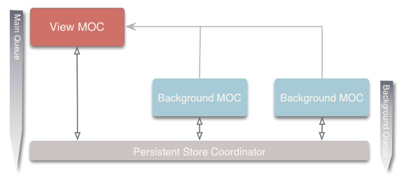
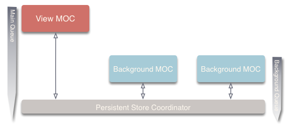
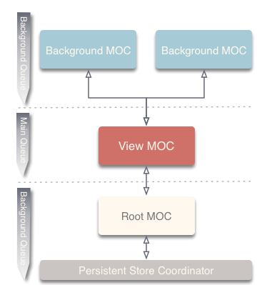
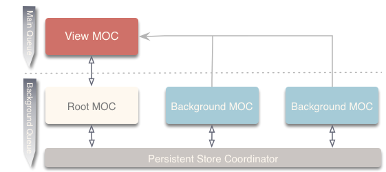

# Coherence 

<a href="https://github.com/tonystone/coherence/" target="_blank">
   
</a>
<a href="https://github.com/tonystone/coherence/" target="_blank">
   
</a>
<a href="https://travis-ci.org/tonystone/coherence" target="_blank">
  
</a>
<a href="https://codecov.io/gh/tonystone/coherence" target="_blank">
  
</a>
<a href="https://github.com/tonystone/coherence/" target="_blank">
    
</a>
<a href="https://github.com/tonystone/coherence/" target="_blank">
    
</a>

---
**Coherence**, the configurable CoreData extension for the Web Service era.  Coherence helps you build apps that require persistence, offline storage, store and forward and web connectivity. It provides you with a comprehensive framework for managing low level resources intelligently and efficiently.

# Overview

### Connect
At the heart of Coherence are it's resource management services which are expose via the `Connect` protocol. Coherence provides a generic concrete implementation of the `Connect` protocol with the `GenericConnect` class. Coherence takes on the role of a persistent container (implementing the `PersistentStack` protocol) creating and managing a core data stack for you.  All services it offers outside this are built on top of the `GenericConnect` instance.

### Container

Connect's container is built on top of the Coherence Container which is an implementation of the `PersistentStack` protocol. Connect creates an instance

### Context Strategy

In general usage a CoreData stack can be configured in several configurations base on your use case.  To facilitate this,
Coherence gives you a choice of strategies used by a PersistentStack instance.  The `ContextStrategy` classes encapsulate the layout and behavior of the ManagedObjectContexts of the CoreData stack. `Connect` currently has 4 built in strategies `Direct`, `DirectIndependent`, `IndirectNested` and `Mixed`.  If one of these strategies doesn't give you what you require for your application, you can also create your own by implementing the `ContextStrategyType` protocol.

###### Direct

The `ContextStrategy.Direct`  manages the viewContext and BackgroundContext connected directly to the `NSPersistentStoreCoordinator`.  Changes made to `BackgroundContext`s are propagated directly to the persistentStore allowing merge policies to be set and respected.



- Note: The view context will be kept up to date and persisted to the store when a background context is saved.

###### Direct Independent

The `ContextStrategy.Independent` manages independent contexts (for view and background) connected directly to the `NSPersistentStoreCoordinator`.



- Note: The view context will not be kept up to date with this strategy.

###### Indirect Nested

The `ContextStrategy.Nested` manages nested (parent/child) contexts (for view and background) connected indirectly through a root context to the `NSPersistentStoreCoordinator`.

Propagation of changes to the persistent store are done indirectly in the background through a root context.



- Note: The view context will be kept up to date and persisted to the store when a background context is saved.

###### Mixed

The `ContextStrategy.Mixed` manages a nested (parent/child) viewContexts connected indirectly
through a root context to the `NSPersistentStoreCoordinator` and background contexts
that are connected directly to the `NSPersistentStoreCoordinator`.

Changes made to BackgroundContexts are propagated directly to the persistentStore
allowing merge policies to be set and respected. `viewContext` updates are done purely
in memory and propagated to the persistentStore indirectly in a background thread
through the rootContext.



- Note: The view context will be kept up to date and persisted to the store when a background context is saved.

# Usage 

## Initialization & Startup

During initialization and startup of **Coherence** you can rely on its default behavior, or you can take complete control over these aspects.

Both `GenericConnect` and `GenericPersistentContainer` implement the `PersistentStack` protocol.  This means that the initialization and startup sequence is the same except that `GenericConnect` has one additional requirement which is to `start` the instance.  Other than that, they are completely interchangeable as a `PersistentStack`.

Persistent stores can be attached and detached in steps to facilitate various requirements and use cases.  For instance, you may want to bring a global store online that stores your user tables so you can determine the logged in user.  The user information can be used to decide the proper stores to attach for that user.   This can be accomplished through the methods `attachPersistentStore(for:)` and `detach(persistentStore:)`.

> Note: Both `attachPersistentStore(for:)` and `detach(persistentStore:)` have plural equivalents (`attachPersistentStores(for:)` and `detach(persistentStores:)`) that allow you to attach and detach multiple stores at a time.  In the case of `attach`, you attach multiple stores at the same location (`url`).  Both versions can be intermixed if required.

Stores can be attached at any time after you create the `Connect` or `PersistentStack` instance.  The "attach" methods all take a `StoreConfiguration` which can be used to specify various aspects of the stores as well as an `url` that specifies the location to store the file.

Below we've created startup examples for various use cases including the case described above.

### No Configuration Required

In this scenario, the developer wants a no hassle, simple configuration, so all that is needed are the default values that **Coherence**.  This scenario is as simple as starting the instance after it is instantiated.

```swift
let connect: Connect = GenericConnect<ContextStrategy.Mixed>(name: "MyModelName")

try connect.start()
```

### Custom Configuration Required

In this scenario, the developer has a custom configuration setup for the persistent stores that he wants to maintain.
```swift
let connect: Connect = GenericConnect<ContextStrategy.Mixed>(name: "MyModelName")

try connect.attachPersistentStores(for: [StoreConfiguration(name: "TransientData",  type: NSInMemoryStoreType),
                                         StoreConfiguration(name: "PersistentData", type: NSSQLiteStoreType)])
try connect.start()
```
There are two configurations defined in the users model `TransientData` and `PersistentData` which will be stored in different types of PersistentStores.  In the case of `TransientData`, it will be stored in a `NSInMemoryStoreType` since it is not required to persist between application starts.  `PersistentData` on the other hand, will be stored persistently in a `NSSQLiteStoreType` store at the `defaultStoreLocation`.

### User per configuration

In this scenario, the developer wants a Configuration/PersistentStore per user that logs into the application.
```swift
let connect: Connect = GenericConnect<ContextStrategy.Mixed>(name: "MyModelName")

let userName = loggedInUserName() /* Determine user that is logged */

try connect.attachPersistentStores(at:  URL(fileURLWithPath: "/persistentStores/location/\(userName)"),
                                   for: [StoreConfiguration(name: "TransientData",  type: NSInMemoryStoreType),
                                         StoreConfiguration(name: "PersistentData", type: NSSQLiteStoreType)])

try connect.start()
```
The first step would be to figure out what user is logged in.  Once that information is obtained, `attachPersistentStores(at:for:) can be called with an `url` that points to the location of the stores for the logged in user.


### Global Store, User per configuration

In this scenario, the developer starts a global PersistentStore(s) before starting to connect with a custom Configuration/StoreConfigurations per user that logs into the application.
```swift
let connect: Connect = GenericConnect<ContextStrategy.Mixed>(name: "MyModelName")

try connect.attachPersistentStore(at: URL(fileURLWithPath: "/persistentStores/location"), for: StoreConfiguration(name: "GlobalData", type: NSSQLiteStoreType))

let userName = loggedInUserName() /* Determine user that is logged */

try connect.attachPersistentStores(at:  URL(fileURLWithPath: "/persistentStores/location/\(userName)"),
                                   for: [StoreConfiguration(name: "TransientData",  type: NSInMemoryStoreType),
                                         StoreConfiguration(name: "PersistentData", type: NSSQLiteStoreType)])

try connect.start()
```
This can be achieved by first opening a persistent user database to locate information about the logged in user.  Once determined, PersistentStores in a user specific directory can be opened.  This scenario is very similar to above with the exception that an `url` is specified for the global store in addition to the `url` for the user specific stores.


## Where to initialize and start

The `Connect` instance can be stored in your `AppDelegate` and injected throughout the application to gain access to the services that Coherence offers.  In the following code block, we do just that and also start the instance within the `application(_:didFinishLaunchingWithOptions:)`.  This is a common place to start the instance, but it can be started in any location you desire. 

```swift
@UIApplicationMain
class AppDelegate: UIResponder, UIApplicationDelegate {

    var window: UIWindow?

    let connect: Connect = GenericConnect<ContextStrategy.Mixed>(name: "ModelName")

    func application(_ application: UIApplication, didFinishLaunchingWithOptions launchOptions: [UIApplicationLaunchOptionsKey: Any]?) -> Bool {

        do {
            try self.connect.start()

        } catch {
            fatalError("\(error)")
        }
        return true
    }
}
```

Coherence does not enforce any constraints as to where you initialize or start its instances but understand that until the `Connect` instance has been started, database operation and other services `Connect` offers are not available (this includes your CoreData stack.)

## Actions

**Coherenc.Connect** contains an extensive *process management and monitoring system* based around its concept of the `Action`. Actions encapsulate work related to keeping the data cache in sync
with remote systems through web services as well as offering an environment for running generic tasks within the system.


**Benefits of Actions:**
- [x] Encapsulates work in a manageable class.
- [x] Executes in an managed container.
- [x] Provides managed services by the container.
- [x] Is cancelable.
- [x] Can be monitored during execution.
- [x] Captures run time statistics while executing.
- [x] Can be automatically executed by Coherence to keep the cache in sync (Future)

Actions are executed by Connect via the `execute()` function and return an `ActionProxy` which allows you to control and monitor the action as they are executing.

There are 2 primary types of Actions, a `GenericAction` and an `EntityAction` which are described in more detail below.

### Generic Action

A `GenericAction` is an Action that allows you to encapsulate, monitor, and control the life cycle of just about any type of work including web services that do not interact with the database.  The template below represents a simple template for building you own actions.
The `Action` should implement the `GenericAction` protocol and has a requirement for 2 methods, `execute()` and `cancel()`.  These methods are called back during execution by the container.


```swift

class MyGenericAction: GenericAction {

    internal var canceled: Bool = false

    ///
    /// This will be executed by the container
    ///
    func execute() throws {
    
        guard !canceled else { return }

        /// Perform work here
    }

    func cancel() {
        self.canceled = true
    }
}
```


### Entity Action

In addition, there are `EntityAction`'s which encapsulate data cache synchronization functionality and offer database specific services while offering the same life cycle management functionality as a `GenericAction`.

```swift

class MyEntityAction: EntityAction {

    internal var canceled: Bool = false

    private let webService: MyWebService
    private let parameter1: Double
    private let parameter2: Double

    ///
    /// Capture the parameters you require for the Web Service call in your init
    ///
    public init(webService: MyWebService, parameter1: Double, parameter1: Double) {
        self.webService = webService
        self.parameter1 = parameter1
        self.parameter1 = parameter1
    }

    ///
    /// This will be executed by the container passing you an `ActionContext` to use for your database work.
    ///
    func execute(context: ActionContext) throws {

        guard !canceled else { return }

        let (data, response, error) = webService.execute(request: MyWebServiceTask(parameter1: self.parameter1, parameter2: self.parameter2))

        guard !canceled else { return }

        if let response = response as? HTTPURLResponse {

            switch response.statusCode {

            case 200:
                ///
                /// Process the returned data
                ///
                break
            default:
                break
            }
        }

        ///
        ///  Errors can be thrown directly from actions.  The container will
        ///  catch them and report them back through the notification system
        ///  and you completion block if one was supplied.
        ///
        if let error = error {
            throw error
        }
    }
}
```

# Sources and Binaries

You can find the latest sources and binaries on [github](https://github.com/tonystone/coherence).

# Communication and Contributions

- If you **found a bug**, _and can provide steps to reliably reproduce it_, [open an issue](https://github.com/tonystone/coherence/issues).
- If you **have a feature request**, [open an issue](https://github.com/tonystone/coherence/issues).
- If you **want to contribute**
   - Fork it! [Coherence repository](https://github.com/tonystone/coherence)
   - Create your feature branch: `git checkout -b my-new-feature`
   - Commit your changes: `git commit -am 'Add some feature'`
   - Push to the branch: `git push origin my-new-feature`
   - Submit a pull request :-)

# Installation (CocoaPods)

Coherence is available through [CocoaPods](http://cocoapods.org). Currently Swift is the default so to install it, simply add the following line to your Podfile:

```ruby
pod "Coherence"
```

See the ["Using CocoaPods"](https://guides.cocoapods.org/using/using-cocoapods.html) guide for more information.

# Minimum Requirements

Build Environment

| Platform | Swift | Swift Build | Xcode |
|:--------:|:-----:|:----------:|:------:|
| OSX      | 4.1 | &#x2718; | 9.3 |
| Linux    | Not supported | &#x2718; | &#x2718; |

Minimum Runtime Version

| iOS |  OS X | tvOS | watchOS | Linux |
|:---:|:-----:|:----:|:-------:|:------------:|
| 8.1 | 10.10 | 9.0  | 2.0 | Not supported |

# Author

Tony Stone ([https://github.com/tonystone](https://github.com/tonystone))

# License

Coherence is released under the [Apache License, Version 2.0](http://www.apache.org/licenses/LICENSE-2.0.html)
