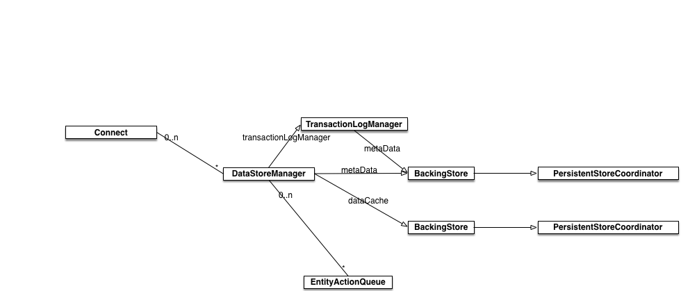

# Connect

[](https://travis-ci.org/Tony Stone/Connect)
[](http://cocoapods.org/pods/Connect)
[](http://cocoapods.org/pods/Connect)
[](http://cocoapods.org/pods/Connect)

## Introduction



## Example

To run the example project, clone the repo, and run `pod install` from the Example directory first.

## Requirements

## Installation

Connect is available through [CocoaPods](http://cocoapods.org). To install
it, simply add the following line to your Podfile:

```ruby
pod "Connect"
```

## Author

Tony Stone ([https://github.com/tonystone] (https://github.com/tonystone))

## License

Connect is released under the [Apache License, Version 2.0] (http://www.apache.org/licenses/LICENSE-2.0.html)
